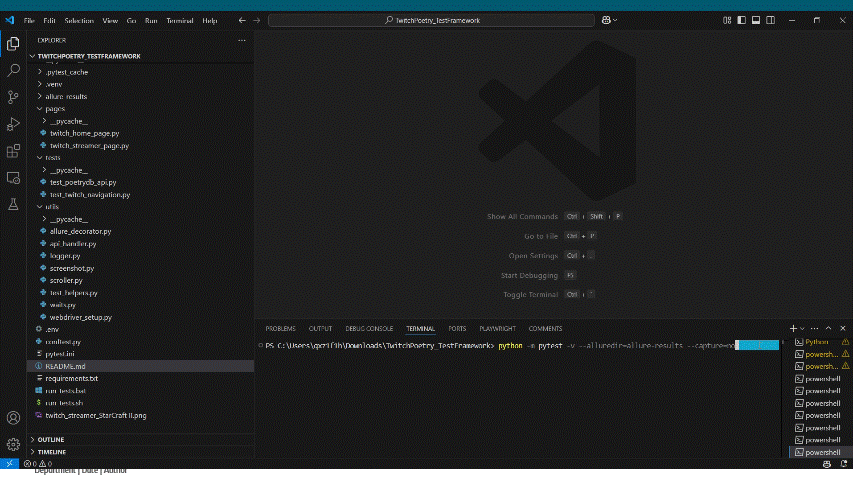
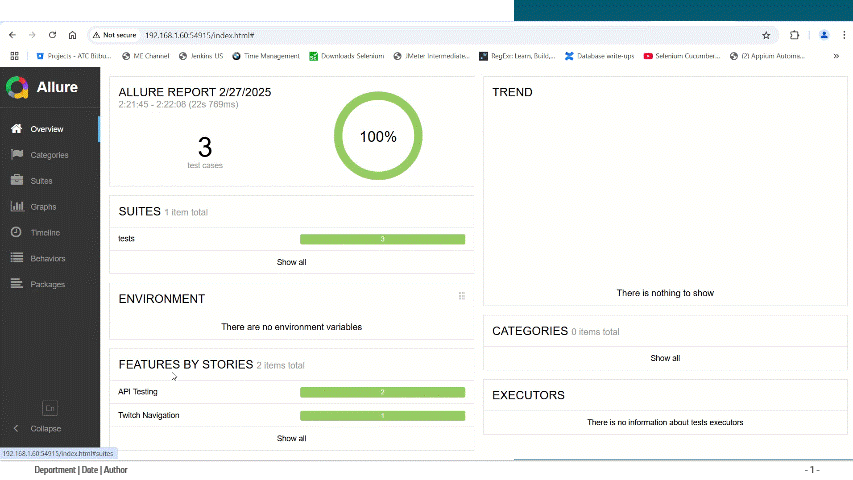

# TwitchPoetry_TestFramework

## 📌 Overview
This is an automated test framework for:
- ✅ **Twitch Web Application Testing (WAP)**
- ✅ **PoetryDB API Testing**
- ✅ **Uses Selenium (Python), Pytest, and Allure reporting**

## 📌 Test Execution Demo 🎥
Here is a short GIF showing the test execution:

 


## 📌 Test Cases

### **Web Application Test Cases**
| **Test Case** | **Description** | **Expected Result** |
|--------------|---------------|---------------------|
| Open Twitch Mobile | Open Twitch on mobile emulator | Twitch loads successfully |
| Click Browse | Click on the Browse button | Browse page opens |
| Click Search Icon | Click the search icon | Search bar appears |
| Input "StarCraft II" | Enter "StarCraft II" in the search bar | Game selected from the search results |
| Scroll Down Twice | Scroll twice to load more results | Additional results load |
| Select First Streamer | Click first streamer in search results | Streamer's page loads |
| Take Screenshot | Capture final screen | Screenshot is saved |

### **API Test Cases**
| **Test Case** | **Endpoint** | **Validation** |
|--------------|------------|---------------|
| **Valid Title Search** | `/title/Ozymandias` | Response contains "Ozymandias" |
| **Valid Author Search** | `/author/Shakespeare` | Response contains "Shakespeare" |
| **Invalid Author Handling** | `/author/UnknownAuthor12345` | Response returns `[]` |

## 📌 Setup & Execution

### **1️⃣ Install Dependencies**
```sh
pip install -r requirements.txt
```

### **2️⃣ Run All Tests**
```sh
pytest -v --alluredir=allure-results --capture=no
```

### **3️⃣ Generate & View Allure Report**
```sh
allure serve allure-results
```
